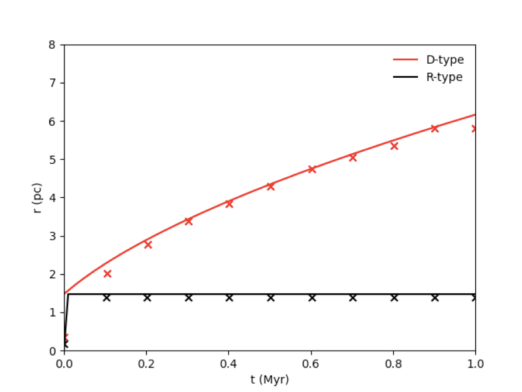

# Physics Module Tests

## Stellar Feedback

### Strömgren Sphere (`tests/stromgren/`)

The Strömgren radius is the point at which the rate of ionizations and recombinations are equal, and is given by

$r_s=\bigg(\frac{3Q}{4\pi \alpha_B n^2}\bigg)^{1/3}$, 

where $Q$ is the ionizing photon rate, $\alpha_B=2.54\times 10^{-13} \rm~cm^3~s^{-1}$ is the case B recombination rate, and $n$ is the number density of atomic Hydrogen.

The R-type test checks whether the ionization equilibrium radius matches the expected value. Heating and cooling is turned off for this test. The time evolution of the R-type ionization front is given by

$R_r(t)=r_s\bigg( 1- e^{-t/t_{rec}} \bigg)^{1/3}$,

where $t_{rec}=(n\alpha_B)^{-1}$ is the recombination rate. The important result of this test is whether the radius is stable over time.

The D-type expansion describes the expanding shockwave formed by the hot ionization front compressing the ambient cold interstellar medium. 
The time evolution of the D-type ionization front is given by

$R_d=r_s\bigg( 1+\frac{7\sqrt{4/3}c_st}{4r_s} \bigg)^{4/7}$

where $c_s=\sqrt{k_BT/\mu m_{\rm H}}$ is the ambient sound speed and the molecular mass is $\mu=1.3$. 

The R-type and D-type tests can be run with `tests/stromgren/run.sh`. The ionization rate is set to $Q=10^{48}\rm~s^{-1}$ with an ambient number density of $n=100\rm~cm^{-3}$. The R-type test is isothermal with an initial ambient temperature of $10^4\rm~K$, while the D-type test allows for heating and cooling with an initial ambient temperature of $100\rm~K$. Gravity is off for these tests. 

The test should output a plot called `stromgren_test.png`, and it should look like this:
