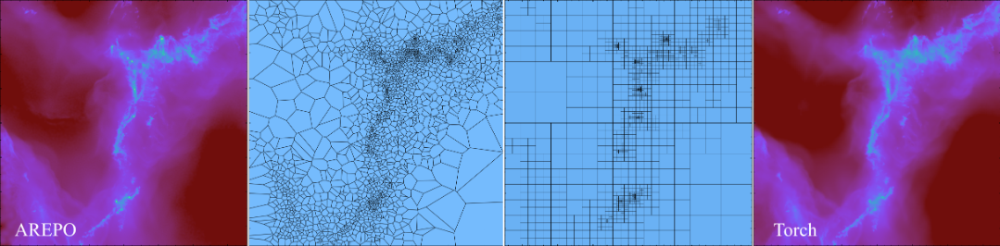
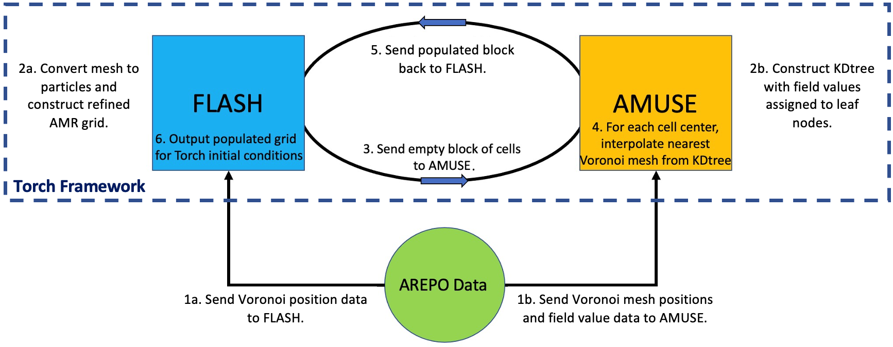

# `VorAMR` User Guide

`VorAMR` was created to allow for output data from other star formation software suites to be used as initial conditions in `Torch`. Currently, `VorAMR` has only been shown to be able to convert data from the star formation code `AREPO` into `Torch` ICs, but in theory can be easily adapted to convert ANY moving-mesh, AMR, or SPH code into `Torch` ICs.The implementation of `VorAMR` is described in detail in [this paper](https://ui.adsabs.harvard.edu/abs/2025ApJ...994...69L/abstract). Here we provide a practical guide for using `VorAMR`.


## How `VorAMR` works

`VorAMR` uses output data from other hydro-codes to build a refined grid in `FLASH` and then populate that grid with field values (density, internal energy, velocity, etc.) via the `AMUSE` interface. By doing this all within the `Torch` framework, the resulting grid and initial gas/particle properties allows `Torch` to immediately launch into a simulation but with external data as its initial conditions. `VorAMR` takes advantage of the ”refine on particle” routines within `FLASH` to construct a refined grid that as accurately as possible mirrors the local mesh scale of the `AREPO` data. `VorAMR` also uses a nearest-neighbor NDInterpolator to fill the `FLASH` grid cells with the field data of the nearest Voronoi mesh element (and therefore the element which encapsulates the cell center).


## How to use `VorAMR`

### `VorAMR` Parameters

`VorAMR` is installed with `Torch`, but is turned off by default. `Torch` operates normally with `VorAMR` turned off. To turn `VorAMR` on, switches must be flipped in the `flash.par` file. Note, the file `flash.par.turbsph` standard does not have VorAMR flags. `flash.par.voramr` is meant to be identical but with the `VorAMR` switches included. All of the `Voramr` parameters are listed below, with instructions on how to use them. Go through and set each one of them carefully according to your simulation. If you change the number of cells in a `FLASH` block, you will need to change `min/max_particles_per_blk` accordingly. Changing the number of cells in a block is **strongly discouraged.**

>Main toggles for `VorAMR`. Do not change these, except for `voramr_source`.
````python
use_voramr = .true. # main control switch
voramr_source = "snapshot_518_9.hdf5" # source data to be converted
voramr_input = "voramr_input.hdf5" # name of file to be read-in by FLASH
refine_on_particle_count = .true. # builds grid based on source data - BE SURE TO TURN OFF FOR NORMAL TORCH
min_particles_per_blk = 4096 # Assumes 16x16x16 blocks
max_particles_per_blk = 4096
refineonjeanslength = .true.
````

> These parameters control where in the Voronoi mesh snapshot `Torch` will center on. Note that if `localRef_r` is smaller than the domain box, the corners of your domain will contain no interpolated data because the refinement region will be a sphere inside a box. Therefore, make this radius extend to the box diagonal.
```python
# Restrict initial refinement by only placing particles within radius
use_localRef = .false.
center_localRef = .false. # Crops FLASH domain centered at localRef_{x,y,z} and centers new domain
# Local refinement center and radius
localRef_x = 3.20621187e+20 
localRef_y = 6.24367575e+20
localRef_z = -1.51873194e+20
localRef_r = 1.543e+20
```

> These parameters set the static background gravitational acceleration. The functional form of the static potential given the parameters set below is: $a(z)=a_1z^3+a_2z^2+a_3z+a_4$. 
```python
sim_withStaticGrav = .true.
sim_aParm1 = 1.31142525e-72 
sim_aParm2 = 1.35401904e-52 
sim_aParm3 = -2.36078509e-30 
sim_aParm4 = 4.06112841e-11 
```

> Torch is capable of de-refining the grid to a user defined level outside of a user defined rectangular region of interest. This is most useful in large-scale runs such as those initialized with VorAMR. To use this capability, the user must set the parameters listed below in the flash.par file.
```python
use_deref = .true.
deref_lref = 2 # level to derefine to
deref_xl = -1.543e+19 
deref_xr = 1.543e+19
deref_yl = -1.543e+19
deref_yr = 1.543e+19
deref_zl = -1.543e+19
deref_zr = 1.543e+19
```

> The important parameters are automatically passed to Torch through `torch_user.py`. The only parameters for `VorAMR` you may need to change in `torch_user.py` are listed below. `numBlocks` **must exceed** the **total** number of blocks in your simulation. If you get weird grid interpolation patterns, check this parameter. If you are running out of memory, you can try pickling the kdtree file. If you change the number of cells in a `FLASH` block, you will need to change `cellsPerBlock` accordingly.

```python
p[’pickle_kdtree’] = False # saves kdtree built from source_file used in interpolation. Useful if
memory strained.
p[’pickle_file_name’] = "kdtree.pickle"
p[’numBlocks’] = 15000 # Quirky parameter, just set to any number larger than total num actual blocks
and FLASH will figure it out.
p[’cellsPerBlock’] = 16
```

### Workflow of a `VorAMR` run

1. After installing `Torch`, set the parameters for `VorAMR` according to the instructions given above. 
2. Change the following `flash.par` parameters to force VorAMR to output a checkpoint file as soon as the interpolation is complete. 
    ```python
    tmax = 6.30e8 # two init timesteps
    dtinit = 3.15e8
    dtmin = 3.15e7
    checkpointFileIntervalTime = 3.15e7 # dt_min
    plotFileIntervalTime = 3.15e8
    particleFileIntervalTime = 3.15e8
    ```
3. The resulting checkpoint can now be considered your initial conditions. Turn `VorAMR` off with `use_voramr = .false.`, change the output parameters back, and now set `restart=.true.` and restart from the outputted checkpoint file. 

In addition to the usual Torch output, VorAMR produces two more files. These files are both produced as sometimes we only want `FLASH` to refine on a portion of the source data, but we want `AMUSE` to have an accurate kdtree for all data to avoid domain edge effects during interpolation. The extra files are:
- `voramr input.hdf5 `: the particle data extracted from the source data. This is what FLASH sees and will refine
on.
- `interp-data.hdf5`: the file from which the interpolation kdtree is built. Only AMUSE sees this file, but then
passes info from it to FLASH. This file will always contain all data from the source file.


## Tips & Troubleshooting

- `VorAMR` works with any number of processors. If you see any information saying to only use `VorAMR` on a single core, that text is outdated. 
- To acheive maximum consistency with the structure of the input data, `lrefine max` should be set such that the highest refinement `FLASH` blocks will contain as many input data points as cells (4096 for +cube16 blocks). 
- If your source data contains star particles that you would like to include in `Torch`, checkout the `arepo_stars` branch for code that does this consistently with the sub-grid star formation routine in `Torch`.
- When importing initial conditions from one simulation framework to another, a lot of instabilities can occur due to the different approximations and methods being applied. The one we've found most prevalent is the discrepency between the applied heating and cooling of two simulations. Also in the `arepo_stars` branch are parameters in `flash.par` that allows for a background UV ionization and heating rate to be applied. Those parameters are: `use_uv_bkgd`, `uv_bkgd_ion_rate`, and `uv_bkgd_heat_rate`. This helps specifically with `AREPO-Torch` IC transitions. Be mindful of similar discrepencies with your own models.     
- If the resolution of the `Torch` grid is much higher than the original grid, you will get numerical artifacts along arepo cell borders. Match the two resolutions as closely as possible to mitigate this problem.
- Sometimes `VorAMR` will run fine, but the resulting grid does not appear to be refined. Check in `turbsph.log`
and see if the number of particles reported matches the dimensions of the array sent so `FLASH` (reported in
slurm file) and what `FLASH` actually reads (reported in flash worker.out). If there is a mismatch, then it’s
likely that some refinement particles are being placed outside of the computational domain. Make sure your
domain dimensions correctly reflect the source data.